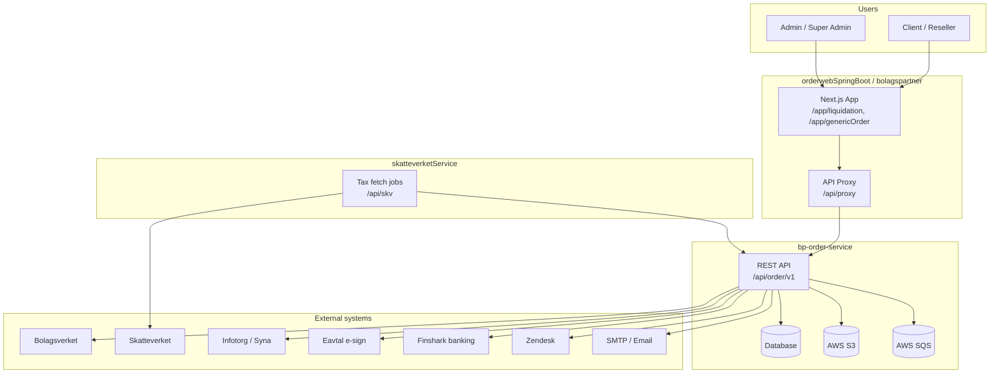
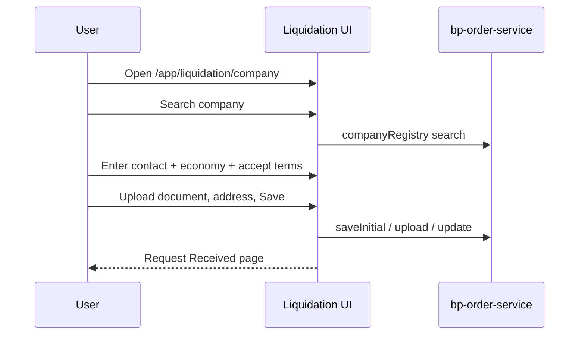
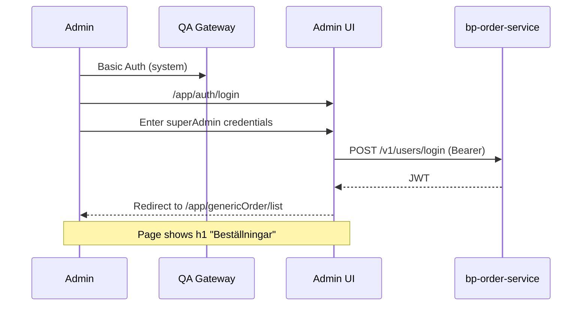
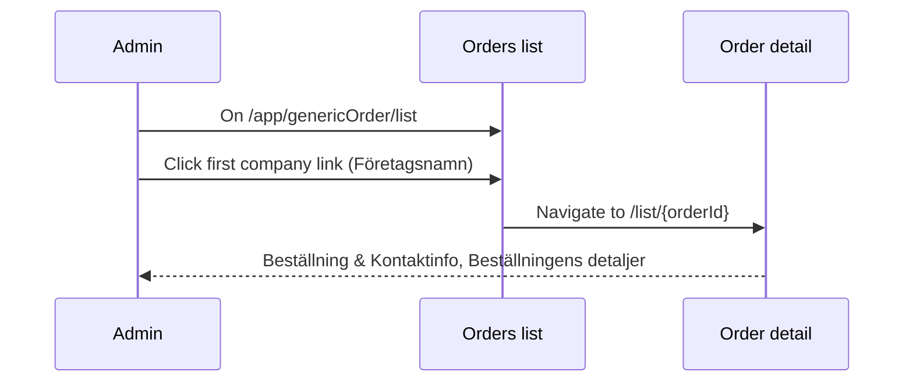

# BolagsPartner — Functional Specification

| Field | Value |
|-------|--------|
| **Document type** | Functional Specification (FSD) |
| **Version** | 1.0 |
| **Date** | 2026-05-28 |
| **Source codebase** | `/Users/tanujrasane/Desktop/Bolags/BolagsPartnerCode` |
| **Documentation approach** | Aligned with *Ideas for documentation (1).docx* — concise, close to code, diagram-first |

---

## 1. Purpose and scope

This document describes **what** the BolagsPartner platform does from a business and user perspective. It is derived from the BolagsPartnerCode repositories and is intended for developers, QA, and product stakeholders.

**In scope**

- End-user liquidation (company wind-down) ordering
- Admin back-office order management
- Core integrations and authentication behaviour
- QA environment access patterns used by automation

**Out of scope**

- Line-by-line API catalog (see `bp-order-service` controllers and `constants.ts`)
- Exhaustive field-level DTO documentation
- Deployment runbooks (belong in service README / CLAUDE.md per repo)

**Maintenance rule (from documentation strategy)**

> If a PR changes behaviour, update this document (or the relevant section in the service README / ADR).

---

## 2. System overview

BolagsPartner is a platform for **liquidating Swedish limited companies (aktiebolag)**. Customers submit liquidation requests online; internal staff process orders, documents, payments, tax accounts, and registrations with Swedish authorities.

### 2.1 Components

| Component | Repository path | Role |
|-----------|-----------------|------|
| **Web application** | `orderwebSpringBoot/bolagspartner` | Next.js UI (Swedish/English), talks to backend via REST proxy |
| **Order API** | `bp-order-service` | Spring Boot — orders, documents, payments, users, integrations |
| **Tax account worker** | `skatteverketService` | Spring Boot — Skatteverket OAuth, tax account fetch, callbacks to order service |

### 2.2 System context diagram

### 2.3 Environment URLs (QA)

| Layer | URL | Notes |
|-------|-----|--------|
| Web app | `https://qa.bolagspartner.se/app/` | HTTP Basic Auth gateway (system login) |
| API | `https://qa.bolagspartner.se/api/` | Basic Auth + Bearer JWT for application auth |
| Admin orders list | `https://qa.bolagspartner.se/app/genericOrder/list` | Post-login landing for admins |
| Order detail | `https://qa.bolagspartner.se/app/genericOrder/list/{orderId}` | Example: `.../list/100672` |
| Liquidation wizard | `https://qa.bolagspartner.se/app/liquidation/company` | Public / reseller flow |

Local development uses Next.js proxy (`src/app/api/proxy/[...path]/route.ts`) with `QA_BACKEND_URL` and `QA_BASIC_AUTH` — see `orderwebSpringBoot/bolagspartner/README.md`.

---

## 3. User roles

| Role | Typical access | Primary UI |
|------|----------------|------------|
| **Guest / Client** | Submit liquidation, upload docs, accept offer | `/app/liquidation/company`, `/app/companyLiquidationOrder/show/[id]` |
| **Reseller** | Orders on behalf of clients, kickback views | User orders + reseller admin routes |
| **Admin / Super Admin** | Full order management, config, overview queues | `/app/genericOrder/*` |
| **Account manager / Auditor / AI user** | Restricted subsets per Spring Security roles | Role-gated routes |

Authentication: **JWT** (`POST /api/order/v1/users/login`) after gateway Basic Auth on QA. Roles stored on `ShiroUser` / `ShiroRole` in `bp-order-service`.

---

## 4. Functional modules

### 4.1 Authentication and registration

| ID | Function | Description | UI route | API (indicative) |
|----|----------|-------------|----------|------------------|
| AUTH-01 | Login | Email/password login; returns access + refresh tokens | `/app/auth/login` | `POST /v1/users/login` |
| AUTH-02 | Logout | End session | `/app/auth/logout` | — |
| AUTH-03 | Register / signup | New user registration | `/app/auth/register`, `/signup` | `POST /v1/users/register` |
| AUTH-04 | Password reset | Forgot / reset password | `/app/auth/forgetPassword`, `/resetPassword` | User controller endpoints |

**QA gateway behaviour:** Browser cannot embed Basic Auth in URL reliably; the Next.js proxy sends Basic Auth when no Bearer token is present, and Bearer token when logged in.

### 4.2 Liquidation order (client-facing)

| ID | Function | Description | UI route | API (indicative) |
|----|----------|-------------|----------|------------------|
| LIQ-01 | Company search | Search Bolagsverket/Infotorg registry for company | `/app/liquidation/company` (Step 1) | `POST /v1/search/companyRegistry` |
| LIQ-02 | Economy step | Financial / company economy inputs | Step 2 | Part of save flow |
| LIQ-03 | Contact step | Contact person, email, terms | Step 3 | Part of save flow |
| LIQ-04 | Submit order | Create order in status `LIQ_NEW` | → `/app/liquidation/saveOrderDetails` | `POST /v1/companyLiquidationOrders/saveInitial` |
| LIQ-05 | Upload documents | Attach files (e.g. ABC.pdf) | Wizard / client portal | `uploadDocs` endpoints |
| LIQ-06 | Accept / decline offer | Client decision on quote | Token / client URLs | `/v1/liqTok/*` |
| LIQ-07 | E-sign | Electronic agreement via Eavtal | `/app/companyLiquidationOrder/egreementStatus/[orderId]` | Egreement API |
| LIQ-08 | Request received | Confirmation page after submission | Confirmation component | — |

**Business rule:** A new liquidation creates a `CompanyLiquidationOrder` with default status **`LIQ_NEW`**. The same company may already exist in an active liquidation (admin sees warning banner on detail page).

### 4.3 Admin order management (genericOrder)

| ID | Function | Description | UI route | API (indicative) |
|----|----------|-------------|----------|------------------|
| ADM-01 | Orders list | Paginated, filterable list of all orders | `/app/genericOrder/list` | `POST /v1/companyLiquidationOrders/list` |
| ADM-02 | Order detail | Full case view: contact, documents, accounting, comments | `/app/genericOrder/list/[orderId]` | Order detail APIs |
| ADM-03 | Edit order | Admin edit mode | `/app/genericOrder/list/[orderId]/edit` | Update endpoints |
| ADM-04 | Status transitions | Send offer, ready for review, complete, sent to Bolagsverket, etc. | Manage order tabs | `MANAGE_ORDER` API set |
| ADM-05 | Document review | Review wizard per document type | Review steps under `[orderId]` | `/v1/liquidation-doc-review` |
| ADM-06 | Payments | Receivable, due, account statement, SIE | `/app/genericOrder/payments/*` | Payment controllers |
| ADM-07 | Overview queues | Operational dashboards (print queue, ready for review, etc.) | `/app/genericOrder/overview/*` | `/v1/overview/*` |
| ADM-08 | Tax accounts | Fetch/display Skatteverket tax account data | `/app/genericOrder/taxAccounts/*` | `/v1/taxAccount/*` + skatteverketService |
| ADM-09 | Comments / history | Side panel on order detail | Right sidenav | Comments / event APIs |
| ADM-10 | New settlement | Create new liquidation from admin | Button on list page | Admin create flow |

**UI labels (Swedish, from `messages/sv.json`):**

| Screen element | Swedish text |
|----------------|--------------|
| List page title | Beställningar |
| Order & contact section | Beställning & Kontaktinfo |
| Order details section | Beställningens detaljer |
| Tab — settlement | Beställning avveckling |
| Tab — manage | Hantera beställning |
| Breadcrumb parent | Bolagsbeställningar |

### 4.4 Supporting admin modules (summary)

| Module | Purpose | Base route |
|--------|---------|------------|
| Fusions | Company merger / fusion cases | `/app/genericOrder/fusions/*` |
| Reseller companies | Partner configuration | `/app/genericOrder/resellerCompany/*` |
| Users (Shiro) | Internal user admin | `/app/genericOrder/shiroUser/*` |
| Statistics | Sales / liquidation stats | `/app/genericOrder/Statistics/*` |
| Cron / AI | Scheduler, GenAI document prompts | Misc under `genericOrder` |
| Received documents | Inbound document inbox | Sidebar: Mottagna dokument |

---

## 5. Key user flows

### 5.1 Flow A — Client liquidation (automated in `liquidationflow.feature`)

### 5.2 Flow B — Admin login and orders list (automated in `adminflow.feature`)

### 5.3 Flow C — Open order detail from list

**Acceptance criteria (detail page):**

1. URL matches `/app/genericOrder/list/{numericOrderId}`
2. Section **Beställning & Kontaktinfo** is visible
3. Section **Beställningens detaljer** is visible
4. Company name from list row appears in breadcrumb or company field

---

## 6. External integrations (business view)

| System | Business purpose | When used |
|--------|------------------|-----------|
| **Bolagsverket** | Company registration, case status, XML filings | Board changes, liquidation registration |
| **Skatteverket** | Tax accounts, balances, transactions | Tax account review, compliance |
| **Infotorg / Syna** | Company registry and credit data | Company search, credit check |
| **Eavtal** | Electronic signing | Client agreements |
| **Finshark** | Bank statements (open banking) | Account certificate / kontoutdrag |
| **Zendesk** | Support tickets | Order sidebar |
| **AWS S3** | Document storage | Uploads, downloads |
| **AWS SQS** | Async processing | Email and background jobs |
| **Email (SMTP)** | Notifications | Status changes, reminders |

**Non-obvious note:** Skatteverket processing is split — `skatteverketService` performs OAuth and fetch jobs, then **callbacks** into `bp-order-service` (`/v1/taxAccount/callback`, etc.). See `skatteverketService` and `application.yml` in both services.

---

## 7. Data entities (functional)

| Entity | Business meaning |
|--------|------------------|
| `CompanyLiquidationOrder` | One liquidation case (status lifecycle from `LIQ_NEW` to completion) |
| `Company` / `CompanyRegistry` | Swedish company identity (org number) |
| `ShiroUser` | Platform user (admin, reseller, client) |
| `ResellerCompany` | Partner organization |
| `LiqRequiredDocumentType` | Checklist of documents required for liquidation |
| `PaymentReceivable` / `PaymentDue` | Money in/out related to the case |
| `FusionTargetCompany` | Merger-related subsidiary case |
| `PrintTask` | Physical mail / print queue item |

Order status values are defined in backend enums (e.g. `LiquidationStatus`); admin UI shows translated labels via `status.{code}` in locale files.

---

## 8. Non-functional requirements

| Area | Requirement |
|------|-------------|
| **Languages** | Swedish (default), English — `next-intl`, `messages/sv.json`, `messages/en.json` |
| **Security** | HTTPS on QA/prod; JWT for API; role-based access on `/v1/**`; no secrets in frontend repo |
| **Performance** | Orders list paginated (e.g. 15 per page, large total count) |
| **Availability** | Depends on QA gateway + `bp-order-service`; tax fetch depends on `skatteverketService` |

---

## 9. Test automation mapping

Automated scenarios live in `BolagsPartner_Automation_Java`:

| Feature file | Scenario | Validates |
|--------------|----------|-----------|
| `liquidationflow.feature` | Verify Liquidation Flow | LIQ-01 … LIQ-08 (client wizard) |
| `adminflow.feature` | Verify Admin Login | AUTH-01, ADM-01 (Beställningar heading) |
| `adminflow.feature` | Verify the order detail page | Flow C (list → detail) |

**QA credentials (automation — rotate in secure config for production use):**

| Layer | User | Purpose |
|-------|------|---------|
| System (Basic Auth) | `dev-bolagspartner` | QA gateway |
| Application | `superAdmin@bolagspartner.se` | Admin login |

---

## 10. Related documentation (per documentation strategy)

| Artifact | Location | Purpose |
|----------|----------|---------|
| **This FSD** | `BolagsPartner_Automation_Java/docs/Functional_Specification.md` | Cross-cutting functional view |
| **CLAUDE.md** (recommended) | Root of each service repo | Build, run, 5-sentence architecture |
| **System diagram** | `docs/system-context.mmd` (optional) | Copy of section 2.2 |
| **ADRs** | `docs/adr/NNN-title.md` | Non-obvious architectural decisions |
| **Service README** | `bp-order-service/README.md`, `bolagspartner/README.md` | How to run locally |

**PR checklist item (recommended):**

- [ ] If this PR changes behaviour, have you updated the relevant documentation (FSD section, CLAUDE.md, ADR, or inline comments)?

---

## 11. Glossary

| Term | Meaning |
|------|---------|
| **Avveckling** | Liquidation / wind-down of a company |
| **Beställningar** | Orders (admin list) |
| **Bolagsverket** | Swedish Companies Registration Office |
| **Skatteverket** | Swedish Tax Agency |
| **Offert** | Quote / offer to the client |
| **LIQ_NEW** | Initial status for a new liquidation order |
| **genericOrder** | Admin module namespace in the UI |

---

## Document history

| Version | Date | Author | Changes |
|---------|------|--------|---------|
| 1.0 | 2026-05-28 | Generated from BolagsPartnerCode analysis | Initial FSD aligned with documentation strategy |
