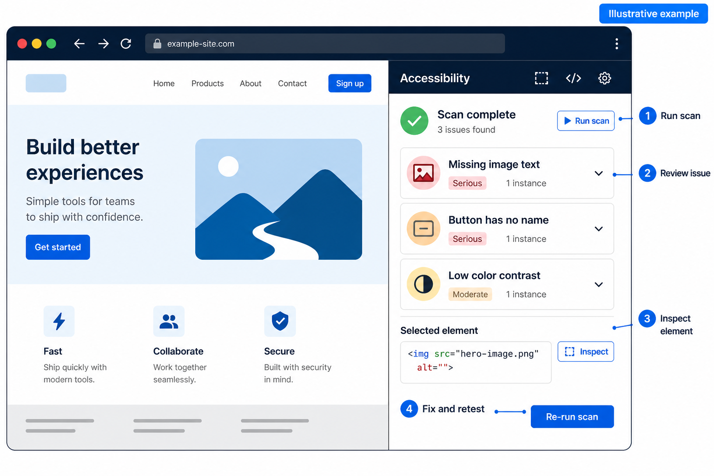
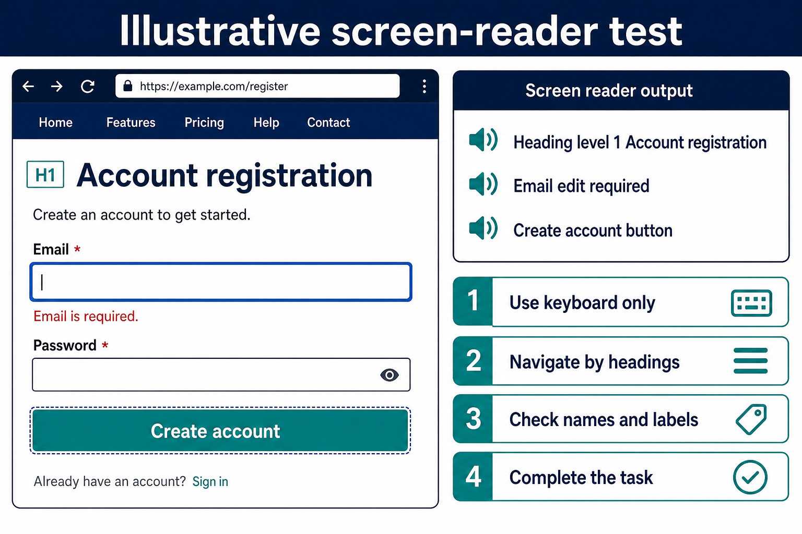
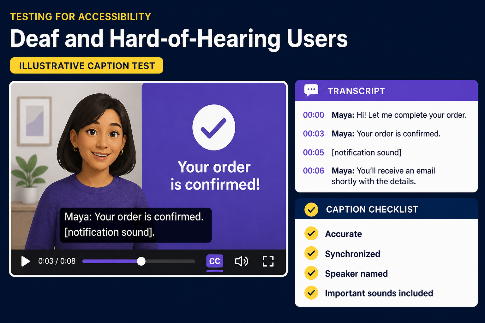

# Accessibility Testing with axe: Blind and Deaf Users

**Meta title:** Accessibility Testing with axe: Blind and Deaf Users  
**Meta description:** A practical guide to testing websites for blind, Deaf, hard-of-hearing, and Deafblind users with axe DevTools, screen readers, captions, and Java Selenium.  
**Target keyword:** axe DevTools accessibility testing  
**Audience:** Quality engineers, developers, SDETs, and accessibility beginners

Can a blind customer register without seeing the screen? Can a Deaf customer understand a product video when the audio is muted? Can a Deafblind customer access the same information through text or a refreshable braille display?

These questions move accessibility testing beyond a checklist. They focus quality engineering on whether people can understand content and complete important tasks independently.

[Deque axe DevTools](https://www.deque.com/axe/devtools/) can identify many code-level barriers against the [Web Content Accessibility Guidelines (WCAG) 2.2](https://www.w3.org/TR/WCAG22/). However, no automated tool can evaluate the complete human experience. An effective approach combines automation, manual testing, assistive technologies, and feedback from people with disabilities.

## Use Inclusive Language

Disability language is personal. Some people prefer identity-first language, such as “blind person” or “Deaf person,” while others prefer person-first language. “Deaf” is often capitalized for a cultural and linguistic identity. Ask for and respect each person’s preference; never assume everyone has the same needs.

## What Are axe-core and axe DevTools?

- **axe-core** is Deque’s open-source accessibility testing engine.
- **axe DevTools** is a commercial toolkit built around that engine, including a browser extension, APIs, Axe Watcher, and a CLI.
- The **browser extension** is a practical starting point for beginners.
- **Java Selenium, Playwright, and CLI integrations** help teams add repeatable checks to CI/CD.

## Understand the Users and Their Tools

Blind users may navigate with NVDA, JAWS, VoiceOver, or TalkBack. They may use keyboard commands to move through headings, landmarks, links, forms, and tables, or read with a refreshable braille display.

Deaf and hard-of-hearing users may rely on captions, transcripts, visual alerts, text chat, or sign-language interpretation. Captions must include meaningful sounds and speaker identification, not only spoken words.

Deafblind users may access content through braille. A descriptive transcript containing speech, sounds, and important visuals can make media more accessible.

## What axe Can and Cannot Test

axe can detect issues such as:

- Images missing alternative text
- Form controls without associated labels
- Buttons or links without accessible names
- Invalid ARIA markup
- Missing page language
- Some heading, landmark, table, and color-contrast issues

axe cannot reliably decide whether alternative text is meaningful, whether a screen-reader journey is understandable, or whether captions are accurate and synchronized. The [W3C accessibility evaluation guidance](https://www.w3.org/WAI/test-evaluate/) states that tools support evaluation but cannot determine accessibility by themselves.

## Beginner: Run an axe Browser Scan

1. Install the axe DevTools extension from the official store for a supported browser.
2. Open a meaningful page state, such as a form with errors, an open dialog, search results, or a shopping cart.
3. Open browser Developer Tools, select the axe panel, and run the scan.
4. Review the rule, impact, affected element, WCAG mapping, and remediation guidance.
5. Fix the issue and scan the same state again.



*Illustrative example: scan, review, inspect, fix, and retest. This is not an official Deque product screenshot.*

Do not report only the count. Explain the affected task and user impact.

### Example: An unnamed icon button

A screen reader may announce an icon-only close control as simply “button.” The user cannot determine its purpose.

```html
<button type="button" aria-label="Close sign-in dialog">
  <svg aria-hidden="true" focusable="false"><!-- close icon --></svg>
</button>
```

Prefer native HTML and visible text whenever possible. Use ARIA when it is needed to provide missing semantics, names, states, or relationships.

## Test the Website for Blind Users

An axe scan is the starting point. The next step is to complete critical journeys using the keyboard and a screen reader.



*Illustrative test: navigate by keyboard and headings, verify names and labels, and complete the task.*

### Keyboard testing

- Use Tab and Shift+Tab to navigate.
- Use Enter, Space, arrow keys, and Escape according to the control.
- Confirm that focus is visible and follows a logical order.
- Check that dialogs manage focus correctly.
- Confirm there is no keyboard trap.
- Use a skip link to bypass repeated navigation.

### Screen-reader testing

Start with a combination supported by your product, such as NVDA with Chrome or Firefox on Windows, or VoiceOver with Safari on macOS.

Check that:

- The page has a meaningful title and heading structure.
- Navigation, main content, search, and footer landmarks are identifiable.
- Links and buttons have clear accessible names.
- Form labels, instructions, required status, and errors are announced.
- Dynamic updates such as search results or cart totals are communicated.
- Images and charts provide useful text alternatives.
- Dialog focus enters the dialog and returns to the triggering control.

Test complete journeys such as registration, sign-in, search, form correction, checkout, and support. Record barriers even when axe reports no violations.

## Test the Website for Deaf Users

Mute the device and complete the journey. No instruction, alert, or important media information should disappear.



*Illustrative test: review captions and the transcript, including speakers and meaningful sounds.*

### Captions and transcripts

- Prerecorded videos need accurate, synchronized captions under WCAG 2.2 Success Criterion 1.2.2.
- Live synchronized media needs captions under Success Criterion 1.2.4.
- Captions should identify speakers and sounds such as `[notification sound]`.
- Podcasts and audio-only instructions need a transcript.
- Descriptive transcripts should include important visual information when necessary.

```html
<video controls>
  <source src="product-demo.mp4" type="video/mp4">
  <track kind="captions" src="product-demo-en.vtt"
         srclang="en" label="English" default>
</video>
```

The presence of a caption file does not prove quality. A person must review its accuracy, synchronization, readability, and completeness.

### Alerts and communication

Provide a visible alternative for audio alerts. Avoid instructions such as “listen for the beep” without another cue. Offer accessible text-based contact methods such as chat, email, or a form. Authentication and support should not depend only on a voice call.

## Advanced: Add axe to Java Selenium

Use the licensed package and version approved by your organization. Keep repository credentials outside source control and follow Deque’s [Java installation guide](https://docs.deque.com/devtools-for-web/4/en/java-install-options/).

```java
driver.get("https://example.test/login");

AxeDriver axeDriver = new AxeDriver(driver);
Results results = new AxeSelenium().run(axeDriver);

assertTrue(
    results.violationFree(),
    () -> "Accessibility violations: " + results.getViolations()
);
```

Run the scan after the page is stable and attach a report to CI. For legacy applications, prevent new critical issues first and reduce the baseline over time.

An assertion with zero violations means “axe detected no automated violations in this tested state.” It does not mean the page is fully accessible or WCAG conformant.

## Practical Definition of Done

- Critical journeys work with keyboard and agreed screen readers.
- Names, labels, errors, and dynamic updates are announced.
- Images have appropriate text alternatives.
- Video captions and audio transcripts have been reviewed.
- Important audio alerts have a visual or text alternative.
- axe reports no unexplained new violations.
- Automated and manual test evidence is attached to the work item.

Whenever possible, include blind, Deaf, hard-of-hearing, and Deafblind participants in research and usability testing. Their experiences should inform product decisions; they should not be treated as a final compliance checkpoint.

## Conclusion

axe DevTools provides fast and consistent feedback, but accessibility quality requires more than a scan. Combine automation with keyboard testing, screen readers, caption and transcript review, and feedback from people with disabilities.

**Start with one critical journey today.** Scan each meaningful state, test the experience manually, document the user impact, and automate stable checks in CI.

Explore the [official axe DevTools documentation](https://docs.deque.com/devtools-for-web/4/en/welcome-axe-devtools/) and [W3C accessibility resources](https://www.w3.org/WAI/test-evaluate/). If you have an accessibility testing practice to share, leave a comment and join the discussion.

## References

- [Deque: axe DevTools for Web](https://docs.deque.com/devtools-for-web/4/en/welcome-axe-devtools/)
- [Deque University: axe rules](https://dequeuniversity.com/rules/axe/)
- [W3C: WCAG 2.2](https://www.w3.org/TR/WCAG22/)
- [W3C: Evaluating web accessibility](https://www.w3.org/WAI/test-evaluate/)
- [W3C: Prerecorded captions](https://www.w3.org/WAI/WCAG22/Understanding/captions-prerecorded.html)
- [W3C: Transcripts](https://www.w3.org/WAI/media/av/transcripts/)

**Tags:** AccessibilityTesting, BlindAccessibility, DeafAccessibility, ScreenReaderTesting, CaptionTesting, axeDevTools, WCAG22, Selenium, Java, QualityEngineering
